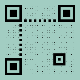
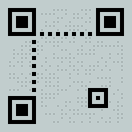
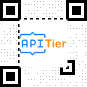

# DOTSCALE QRCode  - Sample API Requests  | APITier

## Sample Request

```bash title="Example Curl Request" 
curl --location --request POST 'https://barcode.apitier.com/v1/generate/qrcode?x-api-key=hv90CBlVBN9R6Tbfx4wsg3CxRTXyk9CA6bvx2f11' \
--header 'Content-Type: application/json' \
--data-raw '{
    "text": "https://www.apitier.com",
      "options": {
          "colorLight": "transparent",
          "width": 150,
          "height": 150,
          "quietZone": 10,
          "quietZoneColor": "transparent",
          "dotScale": "0.5"
          
      }
}'
```

### Sample Response


### Example

| Parameter          | Type    |    Description                            |
| -------------------|-------- | ---------------------------------------   |
| Request URL        | String  |https://barcode.apitier.com/v1/generate/qrcode|
| Request Method     | String  |**POST Request Method -** Parameters need to be send as JSON object in the request body.                                     |
| Request Body       | String  |QR Code is customizable with the following options: <br />**text<br /> colorLight<br /> width <br />height <br />quietZone<br /> quietZoneColor<br /> dotScale**| 
| Response           | String  |              |


## DOTSCALE + COLOR
### Sample Request

```bash title="Example Curl Request"      
curl --location --request POST 'https://barcode.apitier.com/v1/generate/qrcode?x-api-key=hv90CBlVBN9R6Tbfx4wsg3CxRTXyk9CA6bvx2f11' \
--header 'Content-Type: application/json' \
--data-raw '{
    "text": "https://www.apitier.com",
            "options": {
                "width": 150,
                "height": 150,
                "quietZone": 10,
                "quietZoneColor": "transparent",
                "colorDark": "#000000",
                "colorLight": "#A2CDC2",
                "dotScale": "0.20"
                
            }
}'
```

### Sample Response



### Example

| Parameter          | Type    |    Description                            |
| -------------------|-------- | ---------------------------------------   |
| Request URL        | String  |https://barcode.apitier.com/v1/generate/qrcode |
| Request Method     | String  |**POST Request Method -** Parameters need to be send as JSON object in the request body.                                         |
| Request Body       | String  |QR Code is customizable with the following options: <br />**text<br />  width <br />height <br />quietZone<br /> quietZoneColor<br /> colorDark<br /> colorLight<br /> dotScale**| 
| Response           | String  |              |


## DOTSCALE + QUIETZONE
### Sample Request

```bash title="Example Curl Request" 
curl --location --request POST 'https://barcode.apitier.com/v1/generate/qrcode?x-api-key=hv90CBlVBN9R6Tbfx4wsg3CxRTXyk9CA6bvx2f11' \
--header 'Content-Type: application/json' \
--data-raw '{
    "text": "https://www.apitier.com",
          "options": {
          "colorLight": "#c1cdcd",
          "width": 150,
          "height": 150,
          "quietZone": 10,
          "quietZoneColor": "transparent",
          "dotScale": "0.15"
      }
}'
```

### Sample Response



### Example

| Parameter          | Type    |    Description                            |
| -------------------|-------- | ---------------------------------------   |
| Request URL        | String  |https://barcode.apitier.com/v1/generate/qrcode |
| Request Method     | String  |**POST Request Method -** Parameters need to be send as JSON object in the request body.                                         |
| Request Body       | String  |QR Code is customizable with the following options: <br />**text<br /> colorLight<br /> width <br />height <br />quietZone<br /> quietZoneColor<br /> dotScale**| 
| Response           | String  |              |


## DOTSCALE + LOGO
### Sample Request

```bash title="Example Curl Request" 
curl --location --request POST 'https://barcode.apitier.com/v1/generate/qrcode?x-api-key=hv90CBlVBN9R6Tbfx4wsg3CxRTXyk9CA6bvx2f11' \
--header 'Content-Type: application/json' \
--data-raw '{
    "text": "https://www.apitier.com",
            "file":"png",
            "options": {
                "logo": "https://www.apitier.com/static/logo.png",
                "width": 150,
                "height": 150,
                "dotScale": "0.10"
            }
}'
```

### Sample Response



### Example

| Parameter          | Type    |    Description                            |
| -------------------|-------- | ---------------------------------------   |
| Request URL        | String  |https://barcode.apitier.com/v1/generate/qrcode |
| Request Method     | String  |**POST Request Method -** Parameters need to be send as JSON object in the request body.                                         |
| Request Body       | String  |QR Code is customizable with the following options: <br />**text<br /> file<br /> logo<br /> width <br />height <br />dotScale**| 
| Response           | String  |              |


