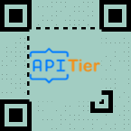

# QRCode with Custom Logo - Sample API Requests  | APITier

## Sample Request

```bash title="Example Curl Request" 
curl --location --request POST 'https://barcode.apitier.com/v1/generate/qrcode?x-api-key=B81TWd7xbo3N51BbAKsMN50eW7Ba1Z2c25mL0eoX' \
--header 'Content-Type: application/json' \
--data-raw '{
"text": "https://www.apitier.com",
          "file":"png",
          "options": {
              "logo": "https://www.apitier.com/static/logo.png",
              "logoBackgroundColor": "#ffffff",
              "width": 150,
              "height": 150
          }
}'
```

### Sample Response


### Example

| Parameter          | Type    |    Description                            |
| -------------------|-------- | ---------------------------------------   |
| Request URL        | String  |https://barcode.apitier.com/v1/generate/qrcode|
| Request Method     | String  |**POST Request Method -** Parameters need to be send as JSON object in the request body.                                     |
| Request Body       | String  |QR Code is customizable with the following options: <br />**text<br /> file<br /> logo <br />logoBackgroundColor <br />width<br /> height**| 
| Response           | String  |              |


## LOGO BACKGROUND COLOR

### Sample Request

```bash title="Example Curl Request"      
curl --location --request POST 'https://barcode.apitier.com/v1/generate/qrcode?x-api-key=B81TWd7xbo3N51BbAKsMN50eW7Ba1Z2c25mL0eoX' \
--header 'Content-Type: application/json' \
--data-raw '{
"text": "https://www.apitier.com",
          "file":"png",
          "options": {
              "logo": "https://www.apitier.com/static/logo.png",
              "width": 150,
              "height": 150,
              "logoBackgroundColor": "#ffe4c4"
          }
}'
```

### Sample Response


### Example

| Parameter          | Type    |    Description                            |
| -------------------|-------- | ---------------------------------------   |
| Request URL        | String  |https://barcode.apitier.com/v1/generate/qrcode |
| Request Method     | String  |**POST Request Method -** Parameters need to be send as JSON object in the request body.                                         |
| Request Body       | String  |QR Code is customizable with the following options: <br />**text<br /> file<br /> logo  <br />width<br /> height<br />logoBackgroundColor**| 
| Response           | String  |              |


## LOGO + COLOR

### Sample Request

```bash title="Example Curl Request" 
curl --location --request POST 'https://barcode.apitier.com/v1/generate/qrcode?x-api-key=B81TWd7xbo3N51BbAKsMN50eW7Ba1Z2c25mL0eoX' \
--header 'Content-Type: application/json' \
--data-raw '{
"text": "https://www.apitier.com",
          "file":"png",
          "options": {
              "logo": "https://www.apitier.com/static/logo.png",
              "width": 150,
              "height": 150,
              "colorLight": "#b9d3ee"
              
          }
}'
```

### Sample Response


### Example

| Parameter          | Type    |    Description                            |
| -------------------|-------- | ---------------------------------------   |
| Request URL        | String  |https://barcode.apitier.com/v1/generate/qrcode |
| Request Method     | String  |**POST Request Method -** Parameters need to be send as JSON object in the request body.                                         |
| Request Body       | String  |QR Code is customizable with the following options: <br />**text<br /> file<br /> logo  <br />width<br /> height<br /> colorLight**| 
| Response           | String  |              |


## LOGO + DOTSCALE

### Sample Request

```bash title="Example Curl Request" 
curl --location --request POST 'https://barcode.apitier.com/v1/generate/qrcode?x-api-key=B81TWd7xbo3N51BbAKsMN50eW7Ba1Z2c25mL0eoX' \
--header 'Content-Type: application/json' \
--data-raw '{
"text": "https://www.apitier.com",
          "file":"png",
          "options": {
              "logo": "https://www.apitier.com/static/logo.png",
              "width": 150,
              "height": 150,
              "dotScale": "0.10"
          }
}'
```

### Sample Response


### Example

| Parameter          | Type    |    Description                            |
| -------------------|-------- | ---------------------------------------   |
| Request URL        | String  |https://barcode.apitier.com/v1/generate/qrcode |
| Request Method     | String  |**POST Request Method -** Parameters need to be send as JSON object in the request body.                                         |
| Request Body       | String  |QR Code is customizable with the following options: <br />**text<br /> file<br /> logo  <br />width<br /> height <br />dotScale**| 
| Response           | String  |              |


## LOGO + QUIETZONE
### Sample Request

```bash title="Example Curl Request" 
curl --location --request POST 'https://barcode.apitier.com/v1/generate/qrcode?x-api-key=B81TWd7xbo3N51BbAKsMN50eW7Ba1Z2c25mL0eoX' \
--header 'Content-Type: application/json' \
--data-raw '{
"text": "https://www.apitier.com",
          "file":"png",
        "options": {
        "logo": "https://www.apitier.com/static/logo.png",
        "colorLight": "#a2a2d0",
        "width": 150,
        "height": 150,
        "quietZone": 10,
        "quietZoneColor": "transparent"
       
    }
}'
```

### Sample Response


### Example

| Parameter          | Type    |    Description                            |
| -------------------|-------- | ---------------------------------------   |
| Request URL        | String  |https://barcode.apitier.com/v1/generate/qrcode|
| Request Method     | String  |**POST Request Method -** Parameters need to be send as JSON object in the request body.                                     |
| Request Body       | String  |QR Code is customizable with the following options: <br />**text<br /> file<br /> logo <br />colorLight <br />width<br /> height <br />quietZone <br /> quietZoneColor**| 
| Response           | String  |              |


## LOGO + DOTSCALE + COLOR

### Sample Request

```bash title="Example Curl Request"      
curl --location --request POST 'https://barcode.apitier.com/v1/generate/qrcode?x-api-key=B81TWd7xbo3N51BbAKsMN50eW7Ba1Z2c25mL0eoX' \
--header 'Content-Type: application/json' \
--data-raw '{
"text": "https://www.apitier.com",
          "file":"png",
          "options": {
              "logo": "https://www.apitier.com/static/logo.png",
              "width": 150,
              "height": 150,
              "dotScale": "0.10",
              "colorLight": "#A2CDC2"
              }
}'
```

### Sample Response



### Example

| Parameter          | Type    |    Description                            |
| -------------------|-------- | ---------------------------------------   |
| Request URL        | String  |https://barcode.apitier.com/v1/generate/qrcode |
| Request Method     | String  |**POST Request Method -** Parameters need to be send as JSON object in the request body.                                         |
| Request Body       | String  |QR Code is customizable with the following options: <br />**text<br /> file<br /> logo  <br />width<br /> height <br />dotScale <br /> colorLight**| 
| Response           | String  |              |


## LOGO BACKGROUND COLOR + COLOR

### Sample Request

```bash title="Example Curl Request" 
curl --location --request POST 'https://barcode.apitier.com/v1/generate/qrcode?x-api-key=B81TWd7xbo3N51BbAKsMN50eW7Ba1Z2c25mL0eoX' \
--header 'Content-Type: application/json' \
--data-raw '{
"text": "https://www.apitier.com",
    "file":"png",
    "options": {
        "logo": "https://www.apitier.com/static/logo.png",
        "width": 150,
        "height": 150,
        "colorLight": "#91a3b0",
        "logoBackgroundColor": "#c4c3d0"
    }
}
'
```

### Sample Response


### Example

| Parameter          | Type    |    Description                            |
| -------------------|-------- | ---------------------------------------   |
| Request URL        | String  |https://barcode.apitier.com/v1/generate/qrcode |
| Request Method     | String  |**POST Request Method -** Parameters need to be send as JSON object in the request body.                                         |
| Request Body       | String  |QR Code is customizable with the following options: <br />**text<br /> file<br /> logo  <br />width<br /> height <br />colorLight <br />logoBackgroundColor**| 
| Response           | String  |              |


## LOGO + TITLE + SUBTITLE

### Sample Request

```bash title="Example Curl Request" 
curl --location --request POST 'https://barcode.apitier.com/v1/generate/qrcode?x-api-key=B81TWd7xbo3N51BbAKsMN50eW7Ba1Z2c25mL0eoX' \
--header 'Content-Type: application/json' \
--data-raw '{
"text": "https://www.apitier.com",
          "file":"png",
          "options": {
              "logo": "https://www.apitier.com/static/logo.png",
              "logoBackgroundColor": "#ffffff",
              "title": "QR Title",
              "subTitle": "QR subTitle",
              "width": 150,
              "height": 150,
              "titleBackgroundColor":"#ffff99"
              
          }
}
'
```

### Sample Response


### Example

| Parameter          | Type    |    Description                            |
| -------------------|-------- | ---------------------------------------   |
| Request URL        | String  |https://barcode.apitier.com/v1/generate/qrcode |
| Request Method     | String  |**POST Request Method -** Parameters need to be send as JSON object in the request body.                                         |
| Request Body       | String  |QR Code is customizable with the following options: <br />**text<br /> file<br /> logo <br />logoBackgroundColor <br />title<br /> subTitle <br />width<br /> height <br /> titleBackgroundColor**| 
| Response           | String  |              |


