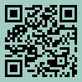
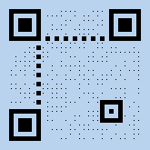

# QUIETZONE QRCode  - Sample API Requests  | APITier

## Sample Request

```bash title="Example Curl Request" 
curl --location --request POST 'https://barcode.apitier.com/v1/generate/qrcode?x-api-key=hv90CBlVBN9R6Tbfx4wsg3CxRTXyk9CA6bvx2f11' \
--header 'Content-Type: application/json' \
--data-raw '{
     "text": "https://www.apitier.com",
          "options": {
              "colorLight": "transparent",
              "width": 150,
              "height": 150,
              "quietZone": 10,
              "quietZoneColor": "transparent"
          }
}'
```

### Sample Response


### Example

| Parameter          | Type    |    Description                            |
| -------------------|-------- | ---------------------------------------   |
| Request URL        | String  |https://barcode.apitier.com/v1/generate/qrcode|
| Request Method     | String  |**POST Request Method -** Parameters need to be send as JSON object in the request body.                                     |
| Request Body       | String  |QR Code is customizable with the following options: <br />**text<br /> colorLight<br /> width <br />height <br />quietZone<br /> quietZoneColor**| 
| Response           | String  |              |


## QUIETZONE + COLOR

### Sample Request

```bash title="Example Curl Request"      
curl --location --request POST 'https://barcode.apitier.com/v1/generate/qrcode?x-api-key=hv90CBlVBN9R6Tbfx4wsg3CxRTXyk9CA6bvx2f11' \
--header 'Content-Type: application/json' \
--data-raw '{
     "text": "https://www.apitier.com",
          "options": {
              "width": 150,
              "height": 150,
              "quietZone": 10,
              "quietZoneColor": "transparent",
              "colorDark": "#000000",
              "colorLight": "#A2CDC2"
              
          }
}'
```

### Sample Response



### Example

| Parameter          | Type    |    Description                            |
| -------------------|-------- | ---------------------------------------   |
| Request URL        | String  |https://barcode.apitier.com/v1/generate/qrcode |
| Request Method     | String  |**POST Request Method -** Parameters need to be send as JSON object in the request body.                                         |
| Request Body       | String  |QR Code is customizable with the following options: <br />**text<br />  width <br />height <br />quietZone<br /> quietZoneColor<br /> colorDark<br /> colorLight**|
| Response           | String  |              |


## QuietZone + DOTSCALE + COLOR

### Sample Request

```bash title="Example Curl Request" 
curl --location --request POST 'https://barcode.apitier.com/v1/generate/qrcode?x-api-key=hv90CBlVBN9R6Tbfx4wsg3CxRTXyk9CA6bvx2f11' \
--header 'Content-Type: application/json' \
--data-raw '{
      "text": "https://www.apitier.com",
    "options": {
        "colorLight": "#b9d3ee",
        "width": 150,
        "height": 150,
        "quietZone": 10,
        "quietZoneColor": "transparent",
        "dotScale": "0.20"
        
    }
}'
```

### Sample Response



### Example

| Parameter          | Type    |    Description                            |
| -------------------|-------- | ---------------------------------------   |
| Request URL        | String  |https://barcode.apitier.com/v1/generate/qrcode |
| Request Method     | String  |**POST Request Method -** Parameters need to be send as JSON object in the request body.                                         |
| Request Body       | String  |QR Code is customizable with the following options: <br />**text<br /> colorLight<br /> width <br />height <br />quietZone<br /> quietZoneColor<br /> dotScale**| 
| Response           | String  |              |


## QuietZone + TITLE + SUBTITLE

### Sample Request

```bash title="Example Curl Request" 
curl --location --request POST 'https://barcode.apitier.com/v1/generate/qrcode?x-api-key=hv90CBlVBN9R6Tbfx4wsg3CxRTXyk9CA6bvx2f11' \
--header 'Content-Type: application/json' \
--data-raw '{
      "text": "https://www.apitier.com",
              "options": {
                "colorLight": "transparent",
                "width": 150,
                "height": 150,
                "quietZone": 10,
                "quietZoneColor": "transparent",
                "title": "QR Title",
                "subTitle": "QR subTitle"
          }
}'
```

### Sample Response


### Example

| Parameter          | Type    |    Description                            |
| -------------------|-------- | ---------------------------------------   |
| Request URL        | String  |https://barcode.apitier.com/v1/generate/qrcode |
| Request Method     | String  |**POST Request Method -** Parameters need to be send as JSON object in the request body.                                         |
| Request Body       | String  |QR Code is customizable with the following options: <br />**text<br /> colorLight<br /> width <br />height <br />quietZone<br /> quietZoneColor<br /> title<br /> subTitle**| 
| Response           | String  |              |


